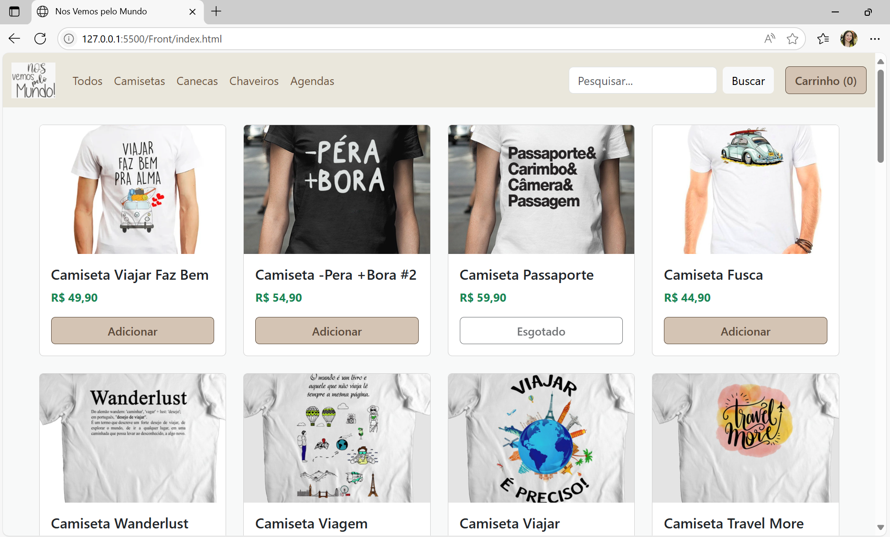
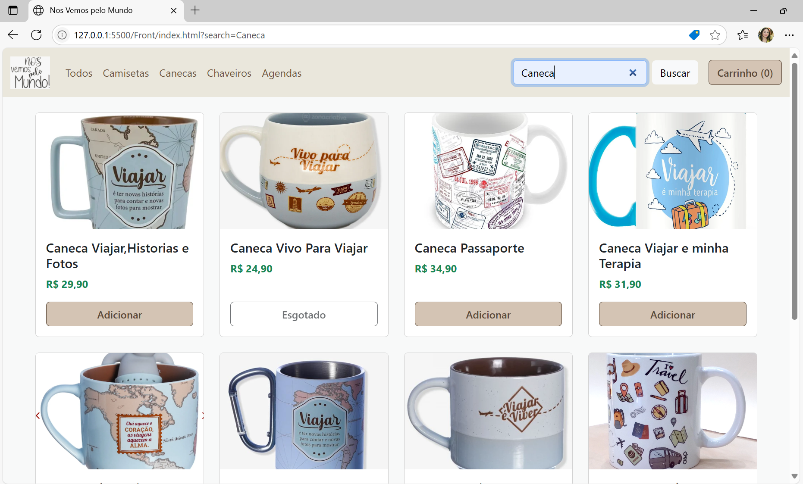
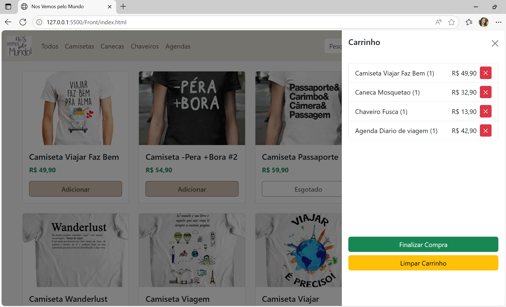

# 🛍️ Nos Vemos pelo Mundo – Loja Virtual

Projeto de uma loja virtual voltada a produtos inspirados em viagens, como camisetas, canecas, chaveiros e agendas. O objetivo é proporcionar uma interface amigável para que usuários possam explorar, buscar e comprar produtos com facilidade.

---

## ✨ Funcionalidades

- Exibição de produtos organizados em categorias
- Filtro por categoria e busca por nome
- Carrinho de compras com controle de estoque
- Persistência de dados via `localStorage`
- Layout responsivo com Bootstrap
- Botão para limpar carrinho
- Indicação de produtos esgotados
- Finalização de compra (simulação)

---

## 🧰 Tecnologias Utilizadas

- **HTML5** + **CSS3**
- **JavaScript (ES Modules)**
- **Bootstrap 5.3**
- **LocalStorage API**

---

## 🖥️ Como Executar o Projeto

1. **Clone ou baixe o repositório:**

   ```bash
   git clone https://github.com/MariaAlineMees/nos-vemos-pelo-mundo.git

   
2. **Abra o projeto no seu navegador:**

Basta abrir o arquivo index.html com duplo clique ou por algum servidor local (como Live Server do VS Code).

✅ Importante: certifique-se de que as pastas assets/images, css/, js/ e data/ estejam com os arquivos corretos.

3. **📂Estrutura de pastas**
📁 nos-vemos-pelo-mundo/
├── index.html
├── css/
│   └── style.css
├── js/
│   └── script.js
├── data/
│   └── products.js
├── assets/
│   └── images/
│       ├── camiseta1.jpg
│       ├── Caneca1.jpg
│       ├── Chaveiro1.png
│       ├── Agenda1.png
│       └── ... (demais imagens)

🖼️ Imagens de Telas

🔷 Tela inicial (lista de produtos)




🔷 Filtro por categoria




🔷 Carrinho lateral (offcanvas)




🚀 Possibilidades de Expansão
Integração com back-end (Node.js, Firebase etc.)

Sistema de pagamento (ex: Mercado Pago, Stripe)

Autenticação e cadastro de usuários

Tela de pedidos e histórico de compras

Administração de estoque

👩‍💻 Autor
Projeto desenvolvido por Maria Aline Mees, como parte de estudos em desenvolvimento front-end com HTML, CSS e JavaScript do curso +Devs2Blu!

💬 "Nos vemos pelo mundo!" 🌍✈️

## 📄 Aviso de Uso

Este projeto foi desenvolvido apenas para fins didáticos, sem fins comerciais.

As imagens utilizadas são meramente ilustrativas e foram obtidas da internet.  
Caso você seja detentor de algum conteúdo e deseje que ele seja removido, por favor entre em contato.

**Este projeto não possui uma licença de uso aberta, pois contém materiais de terceiros.**
